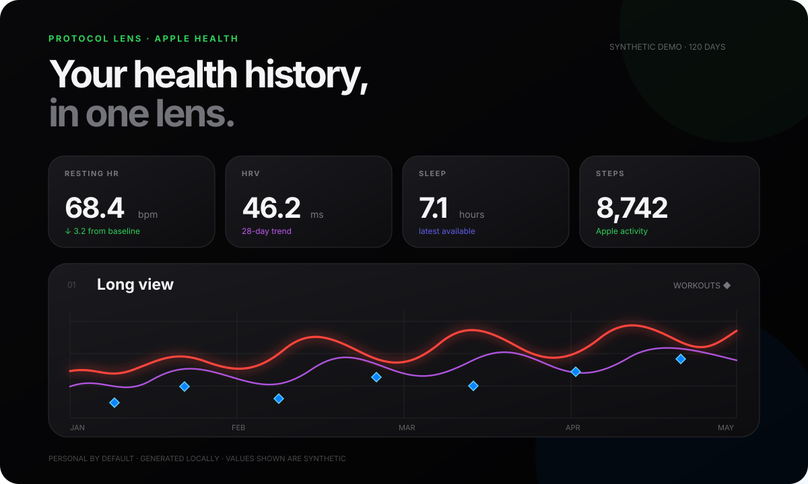

# Protocol Lens

**A local, Apple-first health timeline for understanding trends, workouts, and relationships inside your own data.**

Protocol Lens takes an Apple Health export, keeps the data on your computer, and turns it into a visual report with:

- long-term heart, sleep, activity, weight, and cardio-fitness trends;
- Apple Watch workouts overlaid on daily health signals;
- workout-day versus non-workout-day comparisons;
- a correlation map across Apple-derived metrics;
- visible gaps rather than invented or interpolated measurements.



> [!IMPORTANT]
> Protocol Lens is exploratory software, not a medical device. A correlation is not proof that one metric caused another.

## The first release

This repository intentionally begins with one source: **Apple Health**.

```text
Apple Health ZIP
      │
      ▼
Streaming XML importer
      │
      ├── signals: heart rate, HRV, steps, energy, weight…
      ├── intervals: sleep
      └── events: Apple workouts
      │
      ▼
Local DuckDB file
      │
      ▼
Interactive local HTML report
```

There is no account, cloud database, or hosted health-data upload. The dashboard runs locally.

## Quick start

### 1. Export Apple Health

On iPhone:

1. Open **Health**.
2. Tap **Summary**.
3. Tap your picture or initials.
4. Tap **Export All Health Data**.
5. Save the resulting ZIP to your computer.

Apple’s current instructions are available in [Apple Support](https://support.apple.com/guide/iphone/share-your-health-data-iph5ede58c3d/ios).

### 2. Install

```bash
git clone https://github.com/ThugLifed0233/protocol-lens.git
cd protocol-lens
python3 -m venv .venv
source .venv/bin/activate
pip install -e .
```

### 3. Open the local app

On macOS, double-click:

```text
start-protocol-lens.command
```

Or run:

```bash
protocol-lens app
```

The app asks for one of:

- an Apple Health ZIP or XML export;
- an Excel or CSV file;
- a viewable Google Sheets link.

It then displays the data on a personal local website. A synthetic preview is shown until real data is imported.

### Shareable results without raw data

The **Personal Lab** view records intervention periods locally and compares equal windows before,
during, and after each period.

For GitHub, Protocol Lens can produce a separate reviewed results snapshot containing:

- an approved intervention name;
- the metric and observed direction of change;
- relative change and observation counts;
- data coverage and descriptive confidence.

The snapshot contains no exact dates, doses, notes, or raw values. It is never committed
automatically: the user downloads and reviews it first.

```bash
protocol-lens snapshot
```

See [`public-results/`](public-results/) for the publication rules and a synthetic example.

### Personal Lab

Personal Lab is the supplement-to-Apple-metric explorer:

1. describe a supplement or nootropic;
2. record one or more usage periods;
3. choose an Apple metric;
4. inspect the metric timeline with each period highlighted;
5. compare equal before, during, and after windows.

The profile keeps “what it is,” “what was expected,” and “why it was tracked” separate from the
observed Apple result. See the [Personal Lab structure](docs/personal-lab.md) and the profile and
period templates in [`examples/`](examples/).

### 4. Command-line import

```bash
protocol-lens import /path/to/export.zip
```

The importer:

- reads the export as a stream, so the full XML is not loaded into memory;
- extracts only supported Apple Health and workout records;
- identifies repeat uploads by file and record hashes;
- skips data already imported;
- stores normalized records in `data/processed/protocol-lens.duckdb`.

### 5. Generate a standalone report

```bash
protocol-lens report
open reports/apple-health.html
```

The resulting report is a normal local HTML file. Opening it does not send your health data anywhere.

## Try it with synthetic data

Generate a deterministic synthetic dataset and sample report:

```bash
protocol-lens sample
open reports/sample.html
```

Synthetic data exists only to demonstrate the interface. It is clearly separated from real imports.

## Supported Apple Health data

| Area | Current metrics |
|---|---|
| Heart | Resting heart rate, HRV (SDNN), walking heart rate |
| Activity | Steps, active energy, walking/running distance |
| Recovery | Sleep intervals and daily sleep duration |
| Fitness | Apple workouts, workout duration, energy, distance, VO₂ max |
| Body | Body mass where available |

Excel, CSV, and Google Sheets can add any timestamped numeric metric. Use either:

- long format: `date, metric, value, unit`; or
- wide format: one date column beside numeric metric columns.

More Apple data types can be added in the metric catalog without changing the storage model.

## What the analysis says—and does not say

Protocol Lens can say:

> Resting heart rate averaged 2.4 bpm lower during these recorded workout days.

It does not say:

> Working out caused your resting heart rate to fall.

Every relationship should retain:

- the overlapping observation count;
- the date range;
- missing data;
- the distinction between description and causation.

## Privacy

Raw exports, local databases, journal entries, and generated reports stay on the user’s Mac by
default.

Derived results can still reveal personal information. Public snapshots therefore require manual
review and explicit approval before being committed.

Read the complete [privacy model](docs/privacy.md) before using real data.

## Architecture

The initial architecture is deliberately small:

- **Python** for import and analysis;
- **streaming XML parsing** for large Apple exports;
- **DuckDB** as a local embedded analytical store;
- **pandas** for aligned daily metrics;
- **Plotly** for interactive, exportable reports.

See [architecture.md](docs/architecture.md) for the data flow, schemas, deduplication, and extension points.

## Project evolution

Protocol Lens grew from years of spreadsheet-based training planning, recovery formulas, workout graphs, and personal health research. The repository does not manufacture historical commits. Earlier artifacts are documented as source history; software commits begin when the software begins.

Read [evolution.md](docs/evolution.md) and the [roadmap](docs/roadmap.md).

## Development

```bash
pip install -e ".[dev]"
pytest
ruff check .
```

## License

[MIT](LICENSE)
