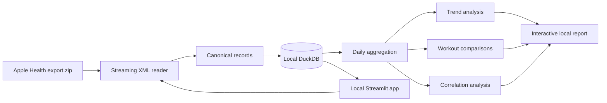
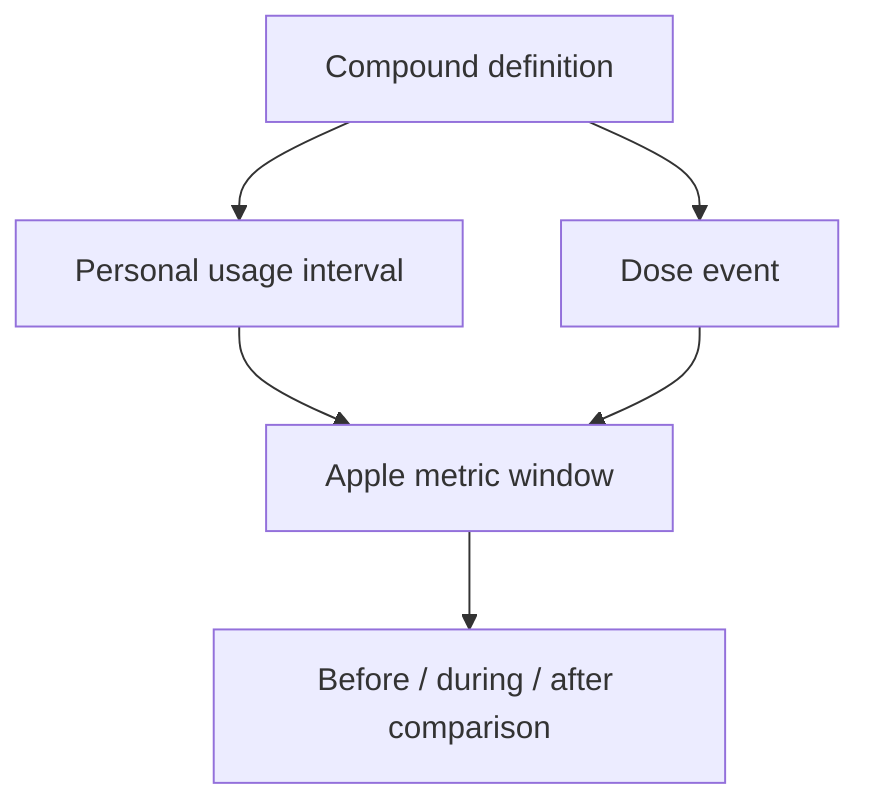
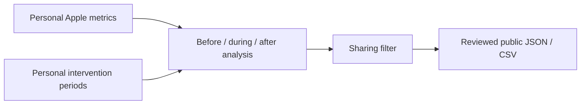

# Architecture

## Design constraints

The first version optimizes for five things:

1. one data source;
2. local privacy;
3. repeatable imports;
4. honest missing data;
5. visual understanding before automated advice.

The product does not require a backend or cloud database.

## System



## Local application

The Mac application is a local Streamlit server. It provides the data intake and visualization
interface while continuing to use the same DuckDB file and analysis functions as the command-line
tools.

The first-run screen accepts:

- Apple Health ZIP or XML;
- Excel, CSV, or XLSX;
- a viewable Google Sheets link.

Google Sheets are downloaded as XLSX and then follow the same spreadsheet pipeline. The app does
not write back to Google.

Spreadsheet files support two shapes:

```text
Long: date | metric | value | unit
Wide: date | weight | protein | focus | …
```

Custom numeric metrics become searchable daily signals without requiring a schema change.

## Canonical record shapes

### Signals

Repeated numeric measurements:

```text
record_id
metric_key
value
unit
start_at
end_at
source_name
source_version
device
```

Examples: resting heart rate, HRV, steps, active energy, weight.

### Intervals

States with a start and end:

```text
record_id
kind
value
start_at
end_at
source_name
```

The first interval type is sleep.

### Workouts

Apple workout events:

```text
record_id
activity_type
start_at
end_at
duration_minutes
energy_kcal
distance_km
source_name
device
```

## Import path

`export.zip` is opened without extraction. The importer locates `export.xml` and walks it using an end-event parser. Each processed XML element is cleared immediately.

This matters because Apple Health exports can be large. Memory use should scale with the batch size rather than the complete export.

Records are written in batches of 10,000.

## Idempotency and updates

Two deduplication layers are used:

1. **File identity:** SHA-256 of the entire supplied file. Reimporting the same export is a no-op.
2. **Record identity:** SHA-256 of the normalized source fields. A later, larger Apple export can overlap the previous one without duplicating old records.

This creates the intended update flow:

```text
Export Apple Health again
        ↓
Import the new complete ZIP
        ↓
Skip known records
        ↓
Append newly observed records
        ↓
Regenerate the report
```

## Daily alignment

Apple data arrives at different frequencies. The analysis layer aligns it by day:

- sum steps, active energy, and distance;
- average resting heart rate, HRV, walking heart rate, weight, and VO₂ max;
- sum asleep interval duration;
- sum workout minutes and count workouts.

The daily frame is used for the first correlation pass. Raw timestamps remain available for later intraday work.

## Missing data

No forward-fill, backward-fill, or interpolation is used in the first release.

```text
Available    a real Apple record exists
Missing      no supported record exists
Derived      a transparent aggregate was calculated
```

Charts set `connectgaps=false`, so empty periods remain visible.

## Correlation boundary

A metric pair appears only when it has at least seven overlapping daily observations. Pearson correlation is descriptive and is displayed with the observation count.

Future analysis should add:

- lagged relationships;
- rolling-period stability;
- repeated workout/non-workout comparisons;
- within-person baselines;
- confounder annotations;
- non-linear and robust statistics.

## Metric extension

A supported quantity is declared once in `catalog.py`:

```python
Metric(
    apple_type="HKQuantityTypeIdentifierRestingHeartRate",
    key="resting_heart_rate",
    label="Resting heart rate",
    aggregation="mean",
    color="#ff453a",
)
```

Once registered, the importer, database, aggregation layer, and report can use it without adding a new table.

## Why DuckDB

DuckDB is embedded, local, and designed for analytical queries. It avoids a server while leaving a path to:

- Parquet snapshots;
- larger exports;
- direct SQL exploration;
- reproducible report generation;
- later local desktop packaging.

## Personal Lab layer

Nootropics and supplements will be introduced after the Apple-only baseline is stable. They should be stored as explicit intervals and dose events, separate from public research data.



An `intervention_profiles` catalog stores description, expected outcomes, personal goal, timeline
color, and source confidence. It does not store observed outcomes. Observations are calculated from
usage periods joined to Apple metric windows, so the expected story and measured result remain
separate.

## Public result snapshots

The personal database may contain exact intervention dates, dose notes, purposes, and raw Apple
metrics. The public snapshot is a different projection:



The sharing filter:

- accepts only intervention periods explicitly marked `publishable`;
- replaces local period identifiers with non-reversible public identifiers;
- removes dates, doses, notes, purposes, and raw metric means;
- retains only relative change, direction, observation counts, coverage, and limitations.

The application never commits this output automatically. Publication is a separate, reviewed Git
operation.
